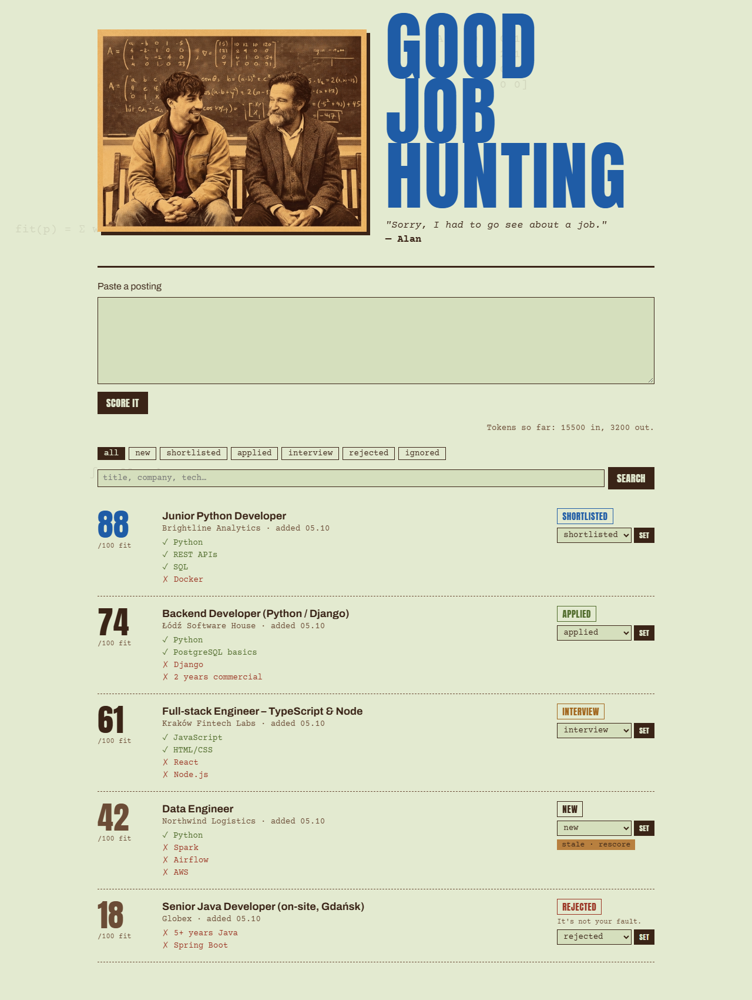
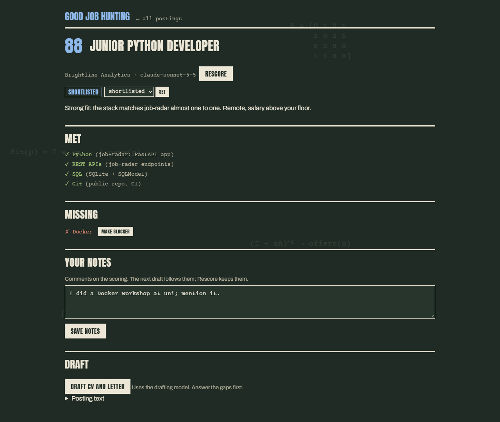
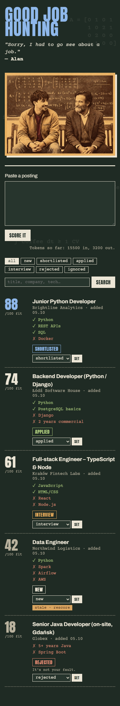

[](https://github.com/alanlisowski/GoodJobHunting/actions/workflows/ci.yml)

# Good Job Hunting

> "Sorry, I had to go see about a job."

A small, local, single-user job-hunting desk. Paste a job posting (or capture it with one click
from the browser) and Claude scores it against your real CV and constraints: which requirements you
meet, with the evidence for each, and which you're missing. For the postings worth it, it drafts a
tailored one-page CV and cover letter as PDFs, in Polish or English.

It's built around one rule: **never claim something the facts don't show.** Every met
requirement must cite a fact from your profile. If a posting asks for something your CV doesn't
cover, the draft leaves it out and asks you a question instead. Your answer becomes a new fact.
Nothing is ever sent or submitted for you.



<table><tr>
<td width="70%"></td>
<td width="30%"></td>
</tr></table>

<sub>Screenshots use made-up postings. Light mode is mint poster paper; dark mode is a green chalkboard.</sub>

## What it does

- **Scores postings 0–100** against your profile and CVs, listing the requirements you meet (each one
  with the fact that proves it), the ones you're missing (blocker or minor) and any dealbreakers it hits.
- **Lets you overrule it.** Flip a "blocker" to minor when you know better, and leave notes on a
  posting that the next draft follows.
- **Drafts a tailored CV and cover letter** as one-page A4 PDFs in the posting's language,
  from your real CV, with the most relevant projects and skills first.
- **Asks about the gaps** instead of inventing things. Answer a gap once and every later score and
  draft knows it.
- **Tracks your applications**: new → shortlisted → applied → interview → rejected / ignored,
  with status filters and a search across title, company and tech.
- **Captures from the browser** with a small Chrome extension. One click on a job posting
  and it shows up scored on the desk.
- **Flags stale scores** when you edit your profile, and shows the running token count of
  the API calls.

## How it works

```
posting text ──► Claude (scoring model) ──► score, met / missing, verdict ──► SQLite ──► desk
                       ▲
your facts ────────────┘   profile.yaml + cv_<lang>.yaml + your answers to past gaps

posting + facts + your notes ──► Claude (drafting model) ──► tailored CV + letter + gap questions
                                                             └─► Jinja2 HTML ──► Playwright ──► PDF
```

- Python 3.12, FastAPI, SQLite via SQLModel, Jinja2 pages and a ~10-line `fetch()` helper. No
  front-end framework.
- Model calls use the Anthropic SDK with structured output validated by Pydantic. The raw response
  and token usage are stored with every score and draft. Your facts are sent as a cached system block.
- PDFs are rendered by headless Chromium with a bundled font, so Polish letters (żółć) survive.
- It runs **on your machine only** (127.0.0.1). The browser extension authenticates with a token,
  and cross-site POSTs are refused, so other websites can't trigger paid API calls.

## Run it

You need [uv](https://docs.astral.sh/uv/) and an [Anthropic API key](https://console.anthropic.com/).

```sh
cd job-radar
uv sync
uv run playwright install chromium

cp .env.example .env                    # ANTHROPIC_API_KEY, and a long random CAPTURE_TOKEN
cp profile.example.yaml profile.yaml    # your city, work modes, salary floor, dealbreakers
```

Then add your CV as `cv_en.yaml` and/or `cv_pl.yaml` next to it. These are your facts. The fields
follow `app/templates/cv.html` (`tests/conftest.py` has a minimal example). `.env`, `profile.yaml`,
your CVs, your answers and the database are all gitignored.

```sh
uv run python -m app.main               # http://127.0.0.1:8000
```

Render a CV on its own (no model call): `uv run python -m app.render cv_pl.yaml output/cv_pl.pdf`.

### Browser extension (one-click capture)

1. `chrome://extensions` → Developer mode → **Load unpacked** → `job-radar/extension/`.
2. In the extension's options, paste `CAPTURE_TOKEN` from `.env`.
3. On a posting, click the icon: ✓ means queued, and it shows up scored on the desk in about 30 s.
   A number on the badge is the HTTP error (401: wrong token); ✗ means the app isn't running.

It only sends the page you're on, when you click. No crawling, no LinkedIn scraping.

## Develop

```sh
uv run pytest          # every model call is mocked; dummy key values in .env are fine
uv run ruff check .
```

CI runs both on every push and pull request. `python -m scripts.eval_ranking` is the project's
go/no-go check: it scores your own sample postings with real API calls and compares the ranking
with the order you'd pick. If the ranking is useless, nothing else matters.

## Credits

Fonts are bundled under the SIL Open Font License (see `job-radar/app/static/fonts/`):
[Anton](https://github.com/googlefonts/AntonFont), [Archivo](https://github.com/Omnibus-Type/Archivo),
[Courier Prime](https://github.com/quoteunquoteapps/CourierPrime) for the desk and
[Lato](https://www.latofonts.com/) for the PDFs. The name is a nod to *Good Will Hunting*.
